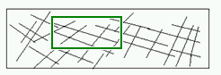
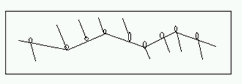

#思考

##从耦合关系谈起

耦合关系直接决定着软件米娜对变化时的行为

* 模块与模块之间的紧耦合使得软件面对变化时，相关的模块都要随之更改

    

如果软件不变化，上面这幅图能够很好的应对，但软件的变化性决定了这种方式很难应对。

* 模块与模块之间的松耦合使得软件面对变化时，一些模块更容易被替换或者更改，但其他模块保持不变。

图中的分支与主线的连接处的圆圈表示接口，分支表示底层，主线表示高层抽象，尽量让底层细节依赖高层抽象。也就是依赖关系的倒置。

松耦合就是模块与模块之间的连接使用接口。接口的实现细节是变化比较快的，

设计模式的应用按照一个演化的思路，起初很难认清系统，分清主次关系，