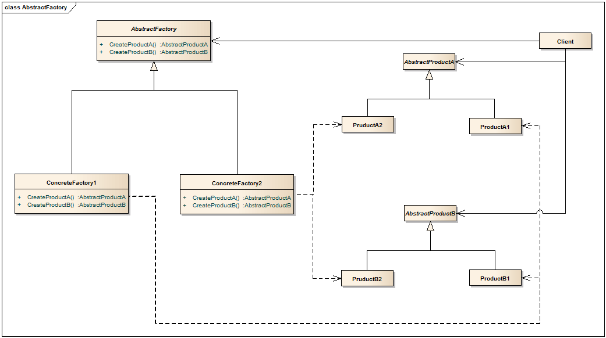

#抽象工厂

##动机

在软件系统中，经常面临着“一系列相互依赖的对象”的创建工作；同时，由于需求的变化，往往存在更多“系列”对象的创建工作。

如果不是多系列，一个静态工厂即可解决。

如何应对这种变化？
如何绕过常规的对象创建方法（new），提供一种“封装机制”来避免客户程序和这种“多系列具体对象创建工作”的紧耦合。

##意图（Intent）

>提供一个接口，让该接口负责创建一系列“相关或者相互依赖的对象”，无需指定他们具体的类。 -GOF《设计模式》

##几个要点

1. 如果没有应对“多系列对象构建”的需求变化，则没有必要使用Abstract Factory模式，这时候使用简单的静态工厂完全可以。

2. “系列对象”指的是这些对象之间有相互依赖、或作用的关系，例如游戏开发场景中的“道路”与“房屋”的依赖，“道路”与“地道”的依赖。

3. Abstract Factory模式主要在于应对“新系列”的需求变动，它的缺点是难以应对对“新对象”需求的变动。

4. Abstract Factory模式经常与Factory Method模式共同组合来应对“新对象闯将”的变动。

##个人理解

抽象工厂模式的客户端更着重于不同的具体工厂生产的不同系列的产品。