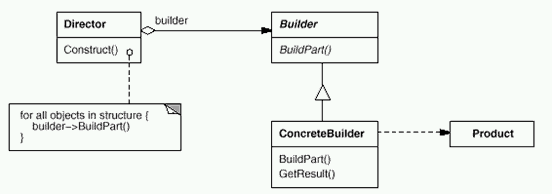
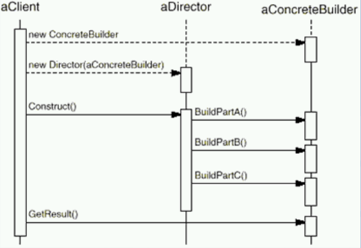

#Build模式

##意图（Intent）

>将一个复杂对象的构建与其表示相分离，使得同样的构建过程可以创建不同的表示。   ——《设计模式》GoF

##结构（Structure）

##协作图

##变化

如：需求中的木门改为防盗门

##Builder模式中的几个要点

* Builder 模式主要用于“分步骤构建一个复杂的对象”。在这其中“分步骤”是一个稳定的算法，而复杂对象的各个部分（不是部分增加或减少，而是部分的细节发生变化）则经常变化。
* 变化点在哪里，封装哪里——Builder模式主要在于应对“复杂对象各个部分”的频繁需求变动，其缺点在于难以应对“分步骤构建算法”的需求变动。
* Abstract Factory模式解决“系列对象”的需求变化，Builder模式解决“对象部分”的需求变化。Builder模式通常和Composite模式组合使用。

##个人理解

Director中的算法相对固定，只关注子对象的生成过程（算法）和最终生成的复杂对象，不关注生成子对象的结果，对复杂对象结果感兴趣。