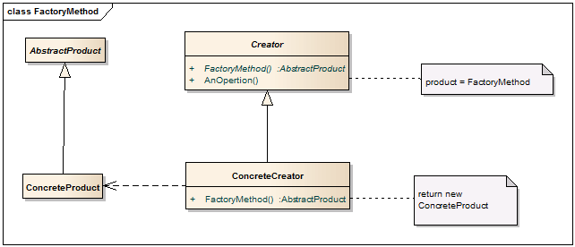

#工厂方法

##动机（Motivation）

在软件系统中，经常面临着“某个对象“的创建工作；由于需求的变化，1.这个对象的具体实现经常面临着剧烈的变化，2.但是它却拥有比较稳定的接口。

如何应对这种变化？如何提供一种“封装机制”来隔离出“这个易变对象”的变化，从而保持系统中“其他依赖该对象的对象”不随着需求改变而改变？

##意图（Intent）

>定义一个用于创建对象的接口，让子类决定实例化那一个类。Factory Method使得一个类的实例化延迟到子类。——《设计模式》 GoF

##结构（Structure）

