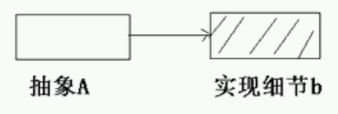
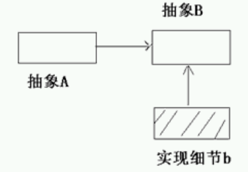

#Prototype模式

##依赖关系的倒置

抽象不应该依赖于实现细节，实现细节应该依赖于抽象。

* 抽象A直接依赖于实现细节b

* 抽象A依赖于抽象B，实现细节b依赖于抽象B

##动机

在软件系统中，经常面临着“某些结构复杂的对象”的创建工作；由于需求的变化，这些对象经常面临着剧烈的变化，但是它们却拥有比较稳定一致的接口。

如何应对这种变化？如何向“客户程序（使用这些对象的程序）”隔离出“这些易变的对象”，从而使得“依赖这些易变对象的客户程序”不随着需求改变而改变？

##意图（Intent）

>使用原型实例指定创建对象的种类，然后通过拷贝这些原型来创建新的对象。  ——《设计模式》GoF

##机构（Structure）

##原型设计模式的理论基础

使用原型模式创建对象比直接new一个对象在性能上要好的多，因为Object类的clone方法是一个本地方法，它直接操作内存中的二进制流，特别是复制大对象时，性能的差别非常明显。

##Prototype模式的几个要点

* Prototype模式同样用于隔离类对象的使用者和具体类型（易变类）之间的耦合关系，它同样要求这些“易变类”拥有“稳定的接口”。
